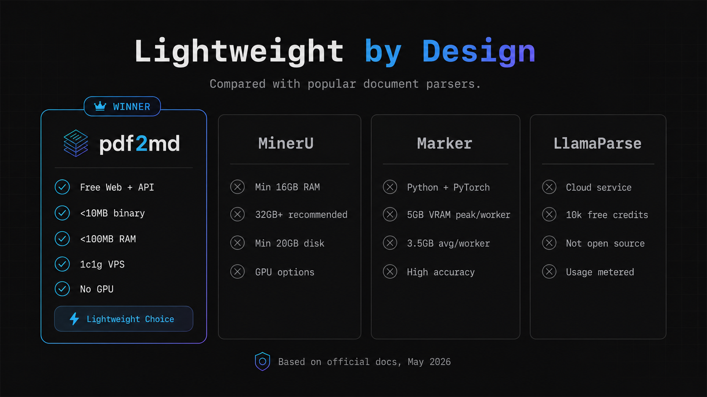
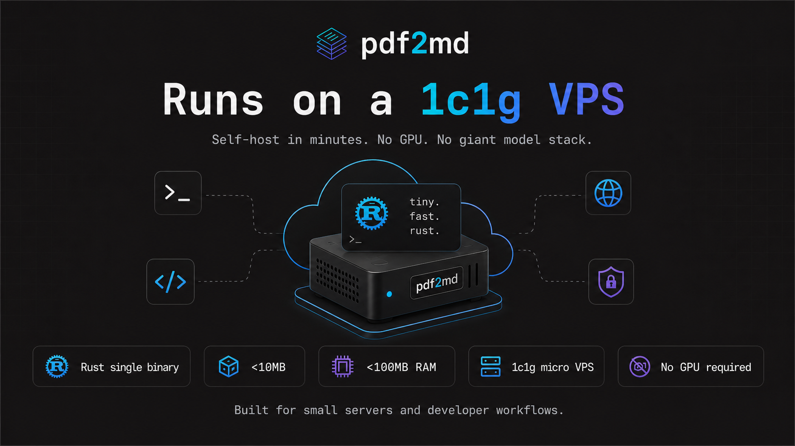
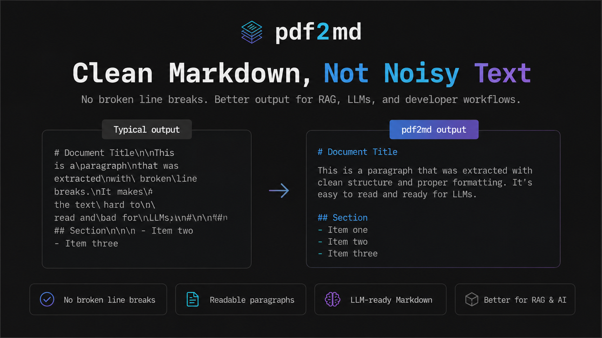
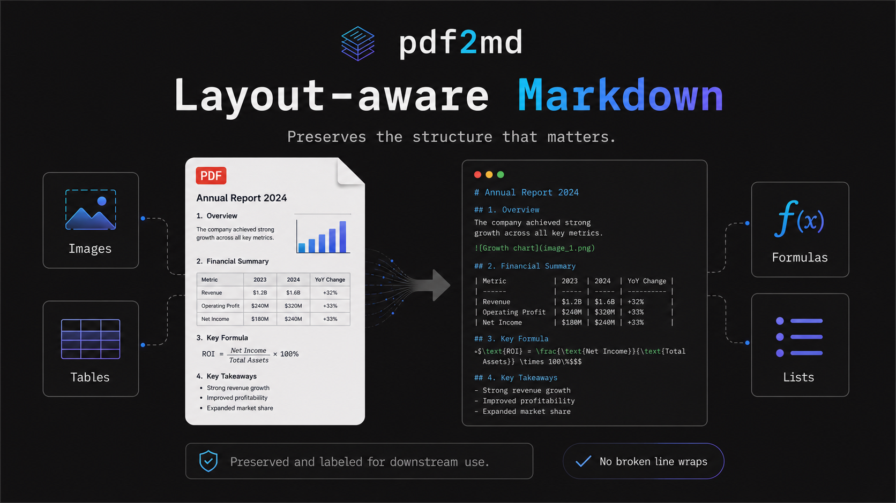
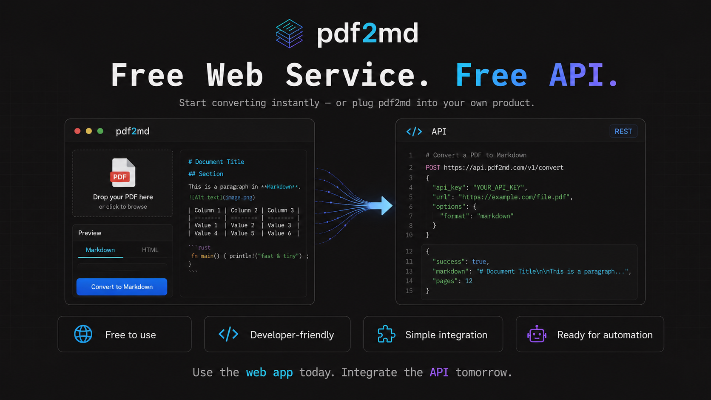

# Blazing Fast PDF2MD Tool
Rust-based PDF to Markdown engine. Images, Tables, Formulas are all preserved.

### Try it: **[https://pdf2md.deepdiy.net/](https://pdf2md.deepdiy.net/)**











## Pre-built Binaries

Pre-built binaries for 4 platforms are available under `dist/`:

#### Step 1 — Move files to your working directory

Copy the binary for your platform and the model directory to your working directory:

```bash
mv dist/pdf2md-<platform> <workdir>/
mv yolo26n-doclaynet_ncnn_model/ <workdir>/
```

#### Step 2 — Run conversion

```bash
cd <workdir>
./pdf2md-<platform> <input.pdf>
```

Arguments:

- `input.pdf` — Input PDF file
- `output.md` — Output Markdown file (optional, defaults to stdout)

Extra options:

- `--asset-dir DIR` — Directory to export page assets
- `--detect-dpi N` — DPI used for layout detection, default `72`
- `--asset-dpi N` — DPI used for asset export, default `150`
- `--page N` — Process only the specified page
- `--model-dir PATH` — Path to the model directory, defaults to `yolo26n-doclaynet_ncnn_model/` in the current directory

## Build from Source

```bash
cargo build --release --bin pdf2md
```

The compiled binary will be at `target/release/pdf2md`.

## Run from Source

```bash
cargo run --release --bin pdf2md -- ./input.pdf ./output.md
```

## Free API

A free API is also available:

**Endpoint**
```
POST https://pdf2md.deepdiy.net/v1/convert
Content-Type: application/pdf
```

**curl example**
```bash
curl -X POST "https://pdf2md.deepdiy.net/v1/convert" \
  -H "Content-Type: application/pdf" \
  --data-binary @paper.pdf
```

**Success response**
```json
{
  "status": "succeeded",
  "markdown": "# Paper title\n\nConverted Markdown...",
  "images": [
    {
      "path": "assets/page_0001_order_0001_class_6.png",
      "url": "https://..."
    }
  ],
  "zip_url": "https://...",
  "download_url": "https://...",
  "expires_in": 300
}
```

**Error response** (HTTP 429)
```json
{
  "error": "busy"
}
```

> The system processes one request at a time (including requests from other users). If busy, it returns `429`.
> If you get a `429`, wait 1 second and retry.
> Each task runs for at most 120 seconds, so there's a chance to acquire the slot within that window.

**Limits**

| Item | Value |
|------|-------|
| Price | Free |
| Max PDF size | 20 MB |
| Concurrency | One request at a time (including other users); returns 429 if busy |
| Max task duration | 120 seconds |
| Conversion timeout | 150 seconds |
| Request timeout | 180 seconds |
| ZIP download link expiry | 5 minutes |
